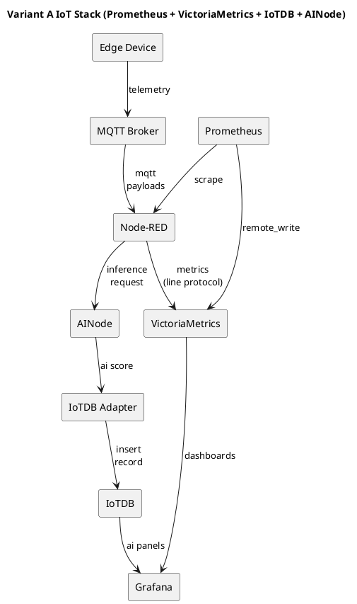

# IoT monitorovací stack

Vítejte! Tento repozitář obsahuje skript **`bootstrap_iot_stack.sh`**, který vám na EC2 instanci rychle nasadí malý, úsporný monitorovací stack pro IoT data. Stack běží ve dvou variantách:

- **VictoriaMetrics + Grafana** (doporučeno pro lehké Prometheus‑style metriky)
- **InfluxDB 1.8 + Grafana** (pokud potřebujete InfluxDB 1.x API)

Skript nainstaluje Docker, připraví perzistentní úložiště, vygeneruje Docker Compose konfiguraci, nastaví Grafanu s datasource a ukázkovým dashboardem a ověří, že se data opravdu ukládají.

## Stack chart

### Renderovatelný diagram (PlantUML)

Pro README‑compatible diagram použijte PlantUML (např. přes GitHub‑integrace nebo externí renderer):



## Rychlý start

```sh
chmod +x bootstrap_iot_stack.sh
sudo ./bootstrap_iot_stack.sh --stack=vm
```

Po instalaci otevřete Grafanu na:

```
http://<server-ip>:3000
```

Přihlašovací údaje nastavíte parametry `--grafana-user` a `--grafana-pass` (výchozí `admin/admin`).

## Instalace na čistou EC2 pomocí `system_configs`

Následující postup vás provede nastavením úplně nové EC2 instance tak, abyste měli funkční stack během několika minut. V adresáři `system_configs/` najdete připravené profily, které volají bootstrap skripty s jasnými parametry.

### 1) Připravte EC2

1. Vytvořte instanci (např. **Ubuntu 22.04 LTS**).
2. V security group povolte **SSH (22)** a porty dle zvoleného profilu (viz tabulka níže).

| Profil | Grafana | VM | Influx | Nginx | MQTT | Node-RED |
| --- | --- | --- | --- | --- | --- | --- |
| 01_lightweight_vm_grafana | 3000 | 8428 | – | – | – | – |
| 02_lightweight_influx_grafana | 3000 | – | 8086 | – | – | – |
| 03_vm_grafana_nginx | 80 | 8428 | – | 80 | – | – |
| 04_vm_grafana_mqtt_nodered | 3000 | 8428 | – | – | 1883/9001 | 1880 |
| 05_full_stack | 80 | 8428 | – | 80 | 1883/9001 | 1880 |

> Tip: Pokud používáte Nginx, neotvírejte Grafanu na 3000 (`--no-expose-grafana` už je v profilu).

### 2) Přihlaste se a stáhněte repozitář

```sh
ssh -i /cesta/k/klíči.pem ubuntu@<public-ip>
sudo apt update
sudo apt install -y git
git clone <URL-repozitáře>
cd aws-ec2-iot-server
```

### 3) Spusťte vybraný profil

Nejprve si nastavte spustitelnost skriptů (stačí jednou):

```sh
chmod +x system_configs/*.sh
```

Pak vyberte profil podle toho, co chcete nasadit:

```sh
sudo ./system_configs/01_lightweight_vm_grafana.sh
```

> Tip: Pro bezpečné ověření můžete předem spustit `DRY_RUN=true ./system_configs/01_lightweight_vm_grafana.sh` a zkontrolovat, co se bude provádět.

### 4) Ověřte běh

- Grafana: `http://<public-ip>:3000` (nebo `http://<public-ip>` při Nginx)
- Přihlašovací údaje: výchozí `admin/admin` (změňte po prvním přihlášení)

### 5) (Volitelně) Vygenerujte demo data

```sh
./system_configs/generate_demo_metrics.sh --stack=vm
```

Tím se do databáze zapíšou ukázkové metriky a v Grafaně uvidíte, že stack přijímá data.

## Rozšířený stack (Nginx + MQTT + Node-RED)

Pro variantu s reverse proxy a MQTT brokerem použijte rozšířený skript:

```sh
chmod +x bootstrap_iot_stack_extended.sh
sudo ./bootstrap_iot_stack_extended.sh --stack=vm --enable-nginx --enable-mqtt --enable-node-red
```

Klíčové parametry:

- `--enable-nginx` – zapne Nginx reverse proxy před Grafanou.
- `--enable-mqtt` – přidá MQTT broker (Eclipse Mosquitto).
- `--enable-node-red` – přidá Node-RED pro transformaci MQTT payloadů do metrik.
- `--no-expose-grafana` – nepublikuje port 3000 na hostu (použijte s Nginx).
- `--expose-db-via-nginx` – volitelně zpřístupní DB API přes Nginx.
- `--mqtt-user` / `--mqtt-pass` – přihlašovací údaje pro MQTT.
- `--mqtt-port` / `--mqtt-ws-port` – porty pro MQTT a WebSocket MQTT.
- `--node-red-port` – port pro Node-RED editor (default 1880).
- `--node-red-user` / `--node-red-pass` – přihlašovací údaje pro Node-RED.

## Požadavky

- Ubuntu 22.04 LTS (nebo jiný Debian‑based systém s `apt`)
- Přístup k internetu pro stažení Dockeru a obrazů
- `sudo`/root práva
- Otevřené porty v EC2 security group **jen podle potřeby**:
  - **Grafana**: TCP **3000** (vždy)
  - **VictoriaMetrics**: TCP **8428** (jen pro `--stack=vm`)
  - **InfluxDB**: TCP **8086** (jen pro `--stack=influx`)
  - **Node-RED**: TCP **1880** (jen pokud zapnete `--enable-node-red`)

## Parametry skriptu

- `--stack=vm|influx`
- `--data-dir=/opt/iotstack`
- `--vm-retention=30d`
- `--influx-db=iot`
- `--grafana-user` / `--grafana-pass`
- `--influx-user` / `--influx-pass`
- `--dry-run` (vypíše příkazy bez spuštění)

## Tipy

- Zálohujte data v `$DATA_DIR/volumes`.
- Vystavujte služby jen přes VPN nebo s omezením na administrátorskou IP.
- Dashboardy můžete ukládat do `$DATA_DIR/provisioning/dashboards`.

Podrobnější provozní postup najdete v `OPERATOR_INSTALLATION_GUIDE.md`.

## Varianta A (Prometheus + IoTDB + AINode)

Pro „minimal changes“ variantu, která zachovává VictoriaMetrics jako Prometheus‑kompatibilní storage a zároveň přidává Prometheus, IoTDB a jednoduchý AINode, použijte:

```sh
chmod +x bootstrap_iot_stack_variant_a.sh
sudo ./bootstrap_iot_stack_variant_a.sh
```

Stack zahrnuje i MQTT broker a Node‑RED s dual‑write flow (VictoriaMetrics + IoTDB). AINode poskytuje jednoduché HTTP API pro inference a posílá výstupy do IoTDB přes `iotdb-adapter`.

### Porty

- **Grafana**: 3000
- **VictoriaMetrics**: 8428
- **Prometheus**: 9090
- **MQTT**: 1883 / 9001 (WS)
- **Node‑RED**: 1880
- **IoTDB**: 6667 (session), 18080 (REST)
- **AINode**: 8090
- **IoTDB adapter**: 8089
