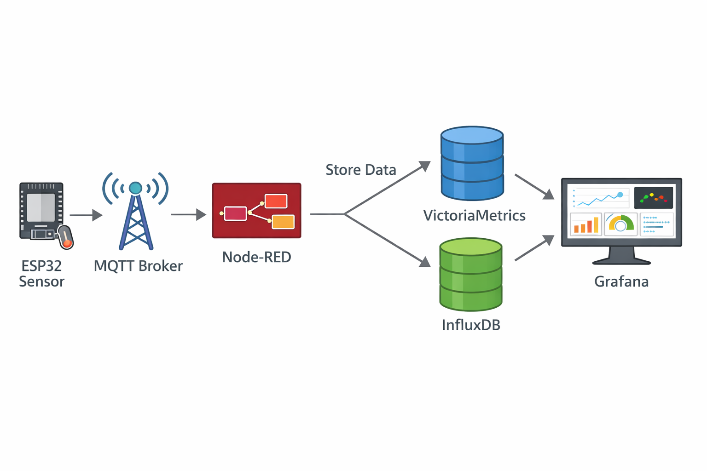

# Lehký IoT monitorovací stack

Vítejte! Tento repozitář obsahuje skript **`bootstrap_iot_stack.sh`**, který vám na EC2 instanci rychle nasadí malý, úsporný monitorovací stack pro IoT data. Stack běží ve dvou variantách:

- **VictoriaMetrics + Grafana** (doporučeno pro lehké Prometheus‑style metriky)
- **InfluxDB 1.8 + Grafana** (pokud potřebujete InfluxDB 1.x API)

Skript nainstaluje Docker, připraví perzistentní úložiště, vygeneruje Docker Compose konfiguraci, nastaví Grafanu s datasource a ukázkovým dashboardem a ověří, že se data opravdu ukládají.

## Stack chart



## Rychlý start

```sh
chmod +x bootstrap_iot_stack.sh
sudo ./bootstrap_iot_stack.sh --stack=vm
```

Po instalaci otevřete Grafanu na:

```
http://<server-ip>:3000
```

Přihlašovací údaje nastavíte parametry `--grafana-user` a `--grafana-pass` (výchozí `admin/admin`).

## Rozšířený stack (Nginx + MQTT)

Pro variantu s reverse proxy a MQTT brokerem použijte rozšířený skript:

```sh
chmod +x bootstrap_iot_stack_extended.sh
sudo ./bootstrap_iot_stack_extended.sh --stack=vm --enable-nginx --enable-mqtt
```

Klíčové parametry:

- `--enable-nginx` – zapne Nginx reverse proxy před Grafanou.
- `--enable-mqtt` – přidá MQTT broker (Eclipse Mosquitto).
- `--no-expose-grafana` – nepublikuje port 3000 na hostu (použijte s Nginx).
- `--expose-db-via-nginx` – volitelně zpřístupní DB API přes Nginx.
- `--mqtt-user` / `--mqtt-pass` – přihlašovací údaje pro MQTT.
- `--mqtt-port` / `--mqtt-ws-port` – porty pro MQTT a WebSocket MQTT.

## Požadavky

- Ubuntu 22.04 LTS (nebo jiný Debian‑based systém s `apt`)
- Přístup k internetu pro stažení Dockeru a obrazů
- `sudo`/root práva
- Otevřené porty v EC2 security group **jen podle potřeby**:
  - **Grafana**: TCP **3000** (vždy)
  - **VictoriaMetrics**: TCP **8428** (jen pro `--stack=vm`)
  - **InfluxDB**: TCP **8086** (jen pro `--stack=influx`)

## Parametry skriptu

- `--stack=vm|influx`
- `--data-dir=/opt/iotstack`
- `--vm-retention=30d`
- `--influx-db=iot`
- `--grafana-user` / `--grafana-pass`
- `--influx-user` / `--influx-pass`
- `--dry-run` (vypíše příkazy bez spuštění)

## Tipy

- Zálohujte data v `$DATA_DIR/volumes`.
- Vystavujte služby jen přes VPN nebo s omezením na administrátorskou IP.
- Dashboardy můžete ukládat do `$DATA_DIR/provisioning/dashboards`.

Podrobnější provozní postup najdete v `OPERATOR_INSTALLATION_GUIDE.md`.
